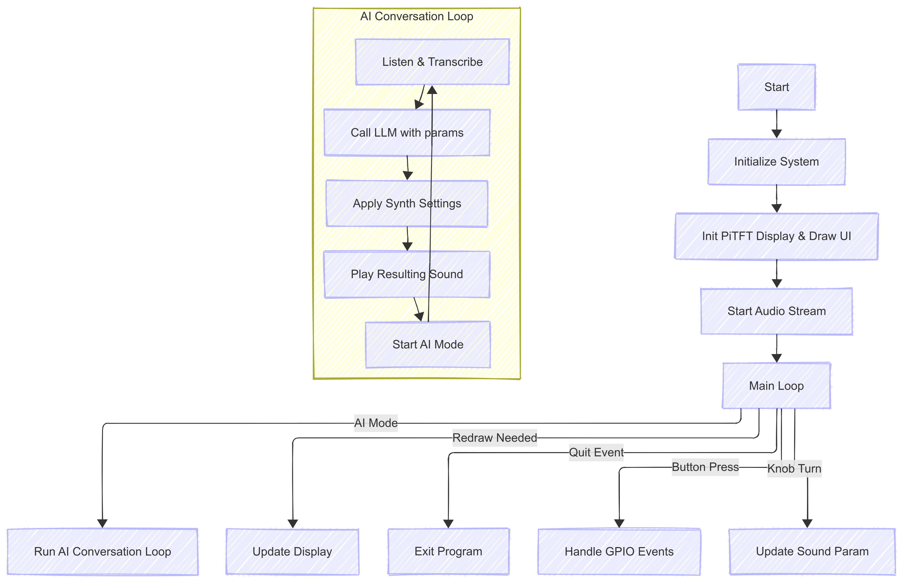
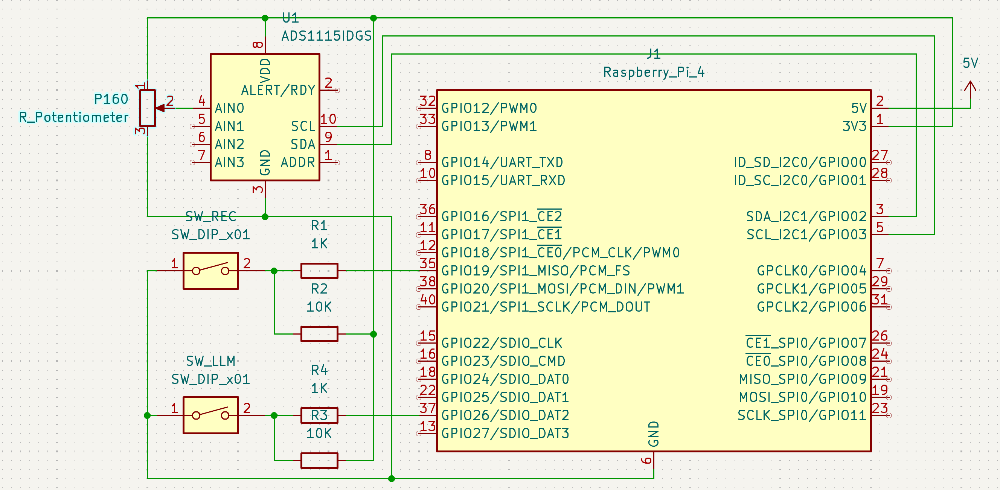

# AI-Powered Digital Synthesizer

*AI for Sound Design on Raspberry Pi 4*

---

## Demo Video

[Watch the demo video](https://www.youtube.com/watch?v=32v_srOQsno&t=1s)

---

## Table of Contents

- [Introduction](#introduction)
- [Project Objective](#project-objective)
- [Design & Implementation](#design--implementation)
- [Code Structure](#code-structure)
- [Diagrams](#diagrams)
- [Modules](#modules)
- [Conclusion](#conclusion)
- [Team Contributions](#team-contributions)
- [Parts List](#parts-list)
- [References](#references)
- [Code Appendix](#code-appendix)

---

## Introduction

> AI-Powered Digital Synthesizer on [Raspberry Pi 4](https://www.raspberrypi.com/products/raspberry-pi-4-model-b/) that lets users design sound in a way that they have never experienced before. Users can choose either to tune the parameters using parameter selection buttons themselves, or enter AI mode to have a conversation with our AI Agent and ask it to generate the sound.

> For software, it is a Python-based real-time sound synthesizer with a built-in LLM Agent. The digital synthesizer supports three channels of waves: saw, sine, and square. Each channel has an envelope, a filter, and a reverb with 15 tunable parameters in total. PiTFT is supported for displaying and selecting parameters and displaying waveform style, envelope curve, and filter percentages. Under AI mode, particle system display as an AI assistant is supported. In the meantime, real-time playback recording is supported by tracking system sound frames.

> As for hardware, we included 6 GPIO-connected buttons, an [ADS1115](https://cdn-shop.adafruit.com/datasheets/ads1115.pdf) ADC, and a [P160 Panel Potentiometer](https://www.ttelectronics.com/TTElectronics/media/ProductFiles/Datasheet/P160.pdf). The GPIO buttons function include: 1 for sound play key, 1 for channel selection, 2 for parameter selection, 1 for AI mode entering/exiting, and 1 for playback control. The potentiometer knob is connected to ADS1115 and then to the Pi4, using the [Adafruit_Blinka](https://github.com/adafruit/Adafruit_Blinka) Python library we can read voltage from the knob in real time.

---

## Project Objective

- **The Digital Synthesizer**
  
  - `Wave generator`: Generates basic waveforms including saw, sine and square. This forms the core sound generation engine of the synthesizer.
  - `Envelope`: Controls how a sound evolves over time using ADSR (Attack, Decay, Sustain, Release) parameters. This shapes the loudness and character of each note, making it expressive and dynamic.
  - `Filter`: Processes the waveform to emphasize or attenuate certain frequency ranges. Typical filters include low-pass, high-pass, band-pass, and notch.
  - `Reverb`: Simulates the effect of sound reflecting in a physical space. This adds depth and spatiality to the sound, making it feel more natural or ambient.
  - `Multi-Channel`: Supports multiple simultaneous voices or instruments. This allows for polyphony (playing multiple notes at once) and layering of different sounds or effects on different channels.
  - `Playback`: Includes functionality for recording, storing, and playing back sequences or performances. Useful for composing loops or playing backing tracks.
  - `Real-time Processing`: ADSR Envelope is in a real-time manner, making the key-press the same as a real digital keyboard. Filter is also real-time, and tuning the filter while playing is possible, just like a DJ set.

- **The AI Sound Generator**
  
  - `Voice to text (VTT)`: Captures and transcribes user voice commands using tools like Vosk and Whisper. It acts as the front-end for hands-free control.
  - `LLM Agent`: Connects the text to a powerful large language model (e.g., gpt-4o) via an API, with carefully designed prompts. This module interprets natural language commands and translates them into synthesizer control actions.
  - `Text to Voice (TTV)`: Converts AI-generated messages to speech and plays them to the user, making the AI system conversation-like.

- **The PiTFT Displayer**
  
  - `Parameter display`: Displays channels, waveform name, envelope, filter, and reverb parameters in a matrix format.
  - `Waveform display`: Displays the corresponding waveform shape when a certain waveform is selected.
  - `ADSR envelope display`: Displays a 4-stage curve line, with curve height dynamically related to ADSR values.
  - `AI Sphere`: Displays a dynamic circle with particles similar to Apple Siri, changing shapes under listening/speaking.

---

## Design & Implementation

1. **Overall Flow**


2. **Key Technical Details**  
 
   - `Real‑time sound triggering`:  
     Hardware events on GPIO‑17 (note key) are connected directly to the synthesis engine.  
     ```python
     # main.py   ––  hardware interrupt
     def GPIO17_callback(channel):
         if GPIO.input(17) == GPIO.LOW:       # key pressed
             sound.note_on()                  # start envelope
         else:                                # key released
             sound.note_off()                 # release envelope
     GPIO.add_event_detect(17, GPIO.BOTH,
                           callback=GPIO17_callback,
                           bouncetime=5)
     ```  
     The **audio thread** is opened once and remains hot for the lifetime of the program:  
     ```python
     with sd.OutputStream(samplerate=SAMPLE_RATE,
                          channels=1,
                          dtype="float32",
                          callback=audio_callback):
         run_main_loop()          # GUI, GPIO, AI, etc.
     ```  
     During every audio block the callback mixes the current sample block produced by the engine:  
     ```python
     # main.py   ––  audio callback
     def audio_callback(outdata, frames, time_info, status):
         sig = sound.process(frames)          # ← pulls from every channel
         outdata[:, 0] = np.clip(sig, -1.0, 1.0)
     ```  
     `sound.process()` iterates over all active **Channel** objects and, for each, calls its envelope‐aware `process()` to obtain a band‑limited waveform whose amplitude is shaped by ADSR. And because the GPIO ISR switches the envelope’s state variables **immediately**, the very next audio block—typically 64–128 samples later—reflects the new amplitude curve, giving sub‑millisecond “feel”. No busy waiting or message queues are needed, so latency is dominated only by the block size and the ALSA driver (~3–5 ms in practice).  

   - `Real-time Enveloping`:  
     Implemented in **channel.py**’s `Envelope` class. Each voice’s ADSR envelope parameters are stored and updated per-sample in `update_samples()`.  
     ```python
     # channel.py
     class Envelope:
         def __init__(self, A, D, S, R, sr=44100):
             self.A, self.D, self.S, self.R = A, D, S, R
             self.sr = sr; self.state='idle'; self.t=0
         def note_on(self):
             self.state, self.t = 'attack', 0
         def note_off(self):
             self.state, self.t = 'release', 0
         def update_samples(self, num):
             out = np.zeros(num)
             dt = 1/self.sr
             for i in range(num):
                 if self.state=='attack':
                     out[i] = self.t/self.A
                     if self.t>=self.A: self.state='decay'; self.t=0
                 # … handle decay, sustain, release …
                 self.t += dt
             return out
     ```  
     The per-sample state machine yields smooth, glitch-free amplitude modulation.

   - `Real-time Filtering`:  
     Implemented as Biquad IIR filters in **channel.py**’s `Filter` class:  
     ```python
     # channel.py
     class Filter:
         def __init__(self, b, a):
             self.b, self.a = b, a
             self.z = np.zeros(max(len(a), len(b))-1)
         def apply(self, x):
             y, self.z = signal.lfilter(self.b, self.a, x, zi=self.z)
             return y
     ```  
     Coefficients `(b, a)` are recalculated on parameter change (UI or AI) and swapped in at buffer-boundaries to avoid clicks.

   - `Reverb`:  
     A simple Feedback Delay Network (FDN) in **channel.py**’s `Reverb` class:  
     ```python
     # channel.py
     class Reverb:
         def __init__(self, delays, g, sr=44100):
             self.delays = [int(d*sr) for d in delays]
             self.g = g
             self.buffer = np.zeros(max(self.delays))
         def apply(self, x):
             out = np.copy(x)
             for d in self.delays:
                 out[d:] += self.g * self.buffer[:-d]
             self.buffer = np.roll(self.buffer, -len(x))
             self.buffer[-len(x):] = out
             return (1-self.wet)*x + self.wet*out
     ```  
     Delay taps `d_i` and gain `g = 10^(–3*d_i/(T₆₀·fs))` are precomputed to match desired reverb time.

   - `AI thread event control with GPIO`:  
     GPIO26 is reserved to abort the AI sequence and return to the main loop immediately:  
     ```python
     # main.py
     ai_abort = threading.Event()
     def GPIO26_callback(_):
         ai_abort.set()              # signal AI thread
     # in AI thread:
     if ai_abort.is_set():
         ai_abort.clear()
         return_to_main_loop()
     ```  
     **Why:** Provides a hard “panic” to exit long LLM calls or speech synthesis without waiting, improving UX and safety in live performance.

   - `AI Mode state machine control`:  
     The AI interaction is managed by a finite-state machine in **reaction.py**:  
     ```plaintext
     IDLE → RECORDING → PROCESSING → SPEAKING → IDLE
     ```  
     Each transition has entry/exit hooks and timeouts. This ensures robust handling of partial speech, API delays, and guarantees return to **IDLE** even on errors.

   - `AI Mode dynamic particle effect`:  
     In **view.py**, the `Particle` class drives visual feedback during “PROCESSING”:  
     ```python
     # view.py
     class Particle:
         def __init__(self, pos, vel, lifespan):
             self.x, self.y = pos; self.vx, self.vy = vel
             self.birth = time.time(); self.lifespan = lifespan
         def update(self, dt):
             self.x += self.vx*dt; self.y += self.vy*dt
         def draw(self, surf):
             age = time.time() - self.birth
             alpha = max(0, 1 - age/self.lifespan)
             if age < self.lifespan:
                 pygame.draw.circle(surf, (255,255,255,int(alpha*255)), (int(self.x),int(self.y)), 2)
     ```  
     A `ParticleSystem` spawns N tokens/sec proportional to LLM output rate, and culls them when `age ≥ lifespan`.

   - `LLM prompting and structured output`:  
     Prompts embed a strict JSON schema:  
     ```python
        SYSTEM_PROMPT = """You are a professional synthesizer sound designer assistant.

        Your job is: based on a user's natural language description of the desired sound characteristics (such as tone, feeling, attack speed, reverb strength, etc.), infer appropriate synthesizer parameters, and generate a full JSON configuration, as follows:

        - Output an overall "description" field (a short 1-2 sentence natural language description summarizing the intended sound character based on the user's input).
        - Then output a "channels" field, which is a list of 3 sound channels, each configured as below:
        - The first channel must always use waveform "saw"
        - The second channel must always use waveform "sin"
        - The third channel must always use waveform "sqr"

        Each channel must contain:
        - waveform (name fixed + frequency matching the description if specified)
        - envelope (attack_time, decay_time, sustain_level, release_time)
        - filter (low, mid, high gain settings)
        - reverb (decay, delay, wet)
        - volume

        The range of each parameter is as follows:
        - attack_time: 0.0 to 1.0
        - decay_time: 0.0 to 1.0
        - sustain_level: 0.0 to 1.0
        - release_time: 0.0 to 1.0
        - low: 0.0 to 1.0
        - mid: 0.0 to 1.0
        - high: 0.0 to 1.0
        - decay: 0.0 to 1.0
        - delay: 0.0 to 0.2
        - wet: 0.0 to 1.0
        - volume: 0.0 to 1.0

        If the user specifies tone (e.g., "punchy", "smooth", "ambient"), modify attack, decay, reverb, and volume accordingly to match the feel.
        If the user specifies a frequency, apply it uniformly across all channels unless otherwise indicated.
        If the user implies to that the parameter is right and want exit, set exit to 1, oherwise set it to 0.

        Notice:
        - The input of user is retrieved from a microphone, so the text may be inaccurate. Please notice this and try get the user's meaning as much as you can.
        - You are able to set different parameters for saw, sin and sqr waveforms. Just do your best to make the sound as close to the user's description as possible.

        Example structure:

        {
        "exit": 0,
        "description": "A punchy and ambient preset with fast attack and rich reverb, suitable for energetic leads.",
        "channels": [
            {
            "waveform": {
                "name": "saw",
                "frequency": 440.0
            },
            "envelope": {
                "attack_time": 0.1,
                "decay_time": 0.3,
                "sustain_level": 0.7,
                "release_time": 0.4
            },
            "filter": {
                "low": 1.0,
                "mid": 0.8,
                "high": 1.2
            },
            "reverb": {
                "decay": 0.5,
                "delay": 0.1,
                "wet": 0.3
            },
            "volume": 0.8
            },
            ...
        ]
        }

        Only output valid JSON.
        """
     ```  
     The returned text is parsed via `resp = json.loads(raw)` and validated before calling `Sound.note_on()`.

   - `TTV and VTT`:  
     (“TTV” = Text-to-Voice and “VTT” = Voice-to-Text)  
     Two ASR/TTS pipelines:
     - **VTT**: `SpeechToTextLocal` (Vosk) & `SpeechToTextWhisper` (OpenAI) selectable at runtime.  
     - **TTV**: `TextToSpeech` use system `espeak` to minimize latency.
     ```python
        subprocess.call(
            [
                'espeak',
                f'-s{self.rate}',    # set speaking rate
                f'-a{self.volume}',  # set volume amplitude
                text
            ],
            stdout=subprocess.DEVNULL,
            stderr=subprocess.DEVNULL
        )
     ```
     Support for streaming output reduces end-to-end latency.

   - `P160, ADS1115 and GPIO circuit design`:  
     We use an **ADS1115** ADC on I²C plus two tactile switches (`SW_REC` on GPIO 19, `SW_LLM` on GPIO 26) wired with pull-up and series resistors for reliable edge detection:
     
     - **Switch Debounce & Safety**:  
       The 10 kΩ pull-ups keep the lines high; the 1 kΩ series resistors limit fault currents if the pin is accidentally reconfigured as output.

     - **Potentiometer on ADS1115**:  
       A 10 kΩ P160 potentiometer is wired as a voltage divider between 3.3 V and GND, with the wiper tied to **ADS1115.AIN0**:

       ```plaintext
         3.3 V ── P160 ── GND
                    │
                    └──> ADS1115 AIN0 (16-bit, up to 860 SPS)
       ```

       The ADS1115 returns a 0–65 535 count, which we scale to 0.0–1.0 and quantize to discrete parameter steps in `knob.py`.

   - `Analog voltage input quantization`:  
     The input voltage is quantized 0.01%, and in the main function, whenver the knob is tuned and the change is over 0.01%, the knob callback function is triggered to change the sound parameters. This makes the knob change real-time and also reduce CPU consumption as well.

    - `Knobbing decetion timestep`:  
     Because ADS1115 doesn't support GPIO callback function, the knobbing can only be polled in the main loop. To reduce system usage, we include a knobbing detection timestep to reduce the sampling rate. We set the interval to 0.1 seconds, and the control flow is shown as below:
     ```python
    with sd.OutputStream(samplerate=SAMPLE_RATE, channels=1, dtype='float32', callback=audio_callback):
        try:
            while running:
                # ...
                if now - knob_in0.last_time > knob_in0.poll_interval:
                    knob_in0.last_time = now
                    new_voltage = knob_in0.channel.voltage
                    if abs(new_voltage - knob_in0.last_voltage) > knob_in0.threshold:
                        knob_in0.last_voltage = new_voltage
                        on_knob_in0_voltage_change(new_voltage)
                # ...
                clock.tick(30)
        except KeyboardInterrupt:
            pass
        finally:
            del pitft
     ```

   - `Playback state machine and buffering`:  
     Live audio recording and playback are controlled via a simple three-state system toggled by GPIO‑19:

     - **State 0**: Idle – wait for user input  
     - **State 1**: Recording – store output buffers in `record_frames`  
     - **State 2**: Playback – stream from `playback_buffer`  

     The logic is triggered via a GPIO interrupt:
     ```python
     def GPIO19_callback(channel):
         if record_state == 0:
             record_frames = []; record_state = 1
         elif record_state == 1:
             playback_buffer = np.concatenate(record_frames).flatten()
             playback_pos = 0; record_state = 2
         elif record_state == 2:
             record_state = 3  # Start playback
     ```

     In `audio_callback`, it conditionally records or plays back:
     ```python
     if record_state == 1:
         record_frames.append(outdata[:, 0].copy())
     elif record_state == 3:
         outdata[:, 0] = playback_buffer[playback_pos:playback_pos+frames]
         playback_pos += frames
     ```

     This block-aligned, buffer-based approach allows seamless one-button looping with no latency issues, ideal for live capture and replay.

   - `Displaying module view.py`:  
     **view.py** defines sub-draw functions:  
     ```python
     rects = _compute_panel_regions(screen.get_size())
     draw_waveform_preview(screen, rects['waveform'])
     draw_envelope_preview(screen, rects['envelope'])
     draw_filter_preview(screen, rects['filter'])
     draw_AI_interface(screen, rects['ai'])
     ```  
     `draw_screen()` bundles these calls in sequence, and **main.py** simply calls `view.draw_screen()` each frame.

   - `Adaptive display refresh rate`:  
     Instead of a fixed FPS, we use a “dirty” flag to only update the PiTFT display when something changes:  
     ```python
     dirty = True
     while running:
         handle_events(lambda: dirty=True)
         if dirty:
             view.draw_screen()
             pygame.display.update()
             dirty = False
         clock.tick(30)
     ```  
     Which brings the befinit of reducing CPU/GPU usage and audio glitches by avoiding unnecessary redraws.

3. **Challenges & Trade‑offs**  
   - **VTT Latency vs. Cost – Vosk vs. Whisper**  
     Local `Vosk` runs entirely on‑device, adding ~10 s processing delay and is less accurate on noisy input on Pi4. `OpenAI Whisper API` offers near‑human transcription quality, yet round‑trip latency only 400–600 ms but incurs per‑minute usage fees. The project defaults to Vosk for low‑price play.

   - **Knob Accuracy vs. CPU Overhead**  
     Reading the `ADS1115` per while loop yields 16‑bit precision but consumes more CPU. Dropping to 0.1s per read reduces CPU use yet reduces effective resolution of knobing. However, the knobbing does not require really-high resolution since this is not a professional DJ set, and 0.1s performs well without user noticing significant delay.

   - **LLM Response Quality/Latency vs. API Expense**  
     There are several OpenAI Models to choose from, including `gpt-4o`, `gpt-4o-mini`, `gpt-o1`, `gpt-o3`. Among them, `gpt-4o-mini` is the cheapest. However, it sould sometimes generate inconsistent result and may not follow the json schema. Since our prompt and input is really limited, and with our testing, `gpt-4o-mini` is a good and stable choice.

---

## Code Structure

```bash
synth/
├── main.py
│   ├── ai_conversation_loop()
│   ├── GPIO19_callback()
│   ├── GPIO26_callback()
│   ├── GPIO17_callback()
│   ├── GPIO22_callback()
│   ├── GPIO23_callback()
│   ├── GPIO27_callback()
│   ├── set_quantized()
│   ├── on_knob_in0_voltage_change()
│   └── audio_callback()
│
├── channel.py
│   ├── Channel
│   │   ├── __init__()
│   │   └── process()
│   ├── Waveform
│   │   └── __init__()
│   ├── Envelope
│   │   ├── __init__()
│   │   ├── update_samples()
│   │   ├── note_on()
│   │   ├── note_off()
│   │   └── process()
│   ├── Filter
│   │   ├── __init__()
│   │   └── apply()
│   └── Reverb
│       ├── __init__()
│       └── apply()
│
├── sound.py
│   └── Sound
│       ├── __init__()
│       ├── add_channel()
│       ├── process()
│       ├── note_on()
│       ├── note_off()
│       └── get_current_params()
│
├── view.py
│   ├── Particle
│   │   ├── __init__()
│   │   ├── update()
│   │   └── draw()
│   ├── get_param_text_center()
│   ├── draw_param()
│   ├── draw_param_ring()
│   ├── draw_params()
│   ├── draw_texts()
│   ├── draw_box()
│   ├── _compute_panel_regions()
│   ├── draw_waveform_preview()
│   ├── draw_envelope_preview()
│   ├── draw_filter_preview()
│   ├── draw_screen()
│   └── draw_AI_interface()
│
├── knob.py
│   └── KnobInput
│       ├── __init__()
│       └── read_knob()
│
└── reaction.py
    ├── call_synth_llm()
    ├── LLMClient
    │   ├── __init__()
    │   └── gen_resp()
    ├── SpeechToTextLocal
    │   ├── __init__()
    │   └── record_and_transcribe()
    ├── SpeechToTextWhisper
    │   ├── __init__()
    │   └── record_and_transcribe()
    └── TextToSpeech
        ├── __init__()
        └── speak()
```

---

## Modules

### `main.py`
- **Program entry & event loop**: sets up audio stream and dispatches GPIO/AI/UI events.  
- **ai_conversation_loop()**: manages the AI listen–think–speak cycle.  
- **GPIO callbacks** (`GPIO19_callback()`, `GPIO26_callback()`, `GPIO17_callback()`, `GPIO22_callback()`, `GPIO23_callback()`, `GPIO27_callback()`): handle record/playback, AI-abort, note triggers, mode switches.  
- **set_quantized()** & **on_knob_in0_voltage_change()**: convert ADC readings into discrete synth parameters.  
- **audio_callback()**: invoked by `sd.OutputStream`; pulls per-block samples via `sound.process()` and writes them to the DAC.

### `channel.py`
- **Channel**: encapsulates one synth voice; `__init__()` sets up oscillator, envelope, filter, reverb; `process()` generates one block of audio.  
- **Waveform**: base class for oscillator tables/waveforms.  
- **Envelope**: ADSR generator (`__init__()`, `update_samples()`, `note_on()`, `note_off()`, `process()`), shaping amplitude sample-by-sample.  
- **Filter**: second-order IIR (biquad) filter (`__init__()`, `apply()`), applied to each voice.  
- **Reverb**: feedback-delay-network reverb (`__init__()`, `apply()`), adds spatial ambience.

### `sound.py`
- **Sound**: top-level audio engine container.  
  - `__init__()`: initializes buffer, channel list.  
  - `add_channel()`: registers a new `Channel`.  
  - `process()`: mixes all channels into one float array per block.  
  - `note_on()`, `note_off()`: broadcast triggers to each channel’s envelope.  
  - `get_current_params()`: query realtime synth/FX settings for UI.

### `view.py`
- **Particle**: visual “thinking” effect with `__init__()`, `update()`, `draw()`.  
- **Layout & drawing utilities**:  
  - `get_param_text_center()`, `draw_param()`, `draw_param_ring()`, `draw_params()`, `draw_texts()`, `draw_box()`, `_compute_panel_regions()`.  
  - Preview renderers: `draw_waveform_preview()`, `draw_envelope_preview()`, `draw_filter_preview()`.  
  - **draw_AI_interface()**: overlays UI during AI processing.  
- **draw_screen()**: composes all sub-draw calls each frame.

### `knob.py`
- **KnobInput**: reads a potentiometer via SPI/ADC;  
  - `__init__()`: configures MCP3008/ADS1115 settings.  
  - `read_knob()`: samples, debounces, and quantizes into discrete control values.

### `reaction.py`
- **call_synth_llm()**: formats user prompt and queries LLM for synth commands.  
- **LLMClient**: wrapper for API (`__init__()`, `gen_resp()`).  
- **SpeechToTextLocal** & **SpeechToTextWhisper** (`__init__()`, `record_and_transcribe()`): two ASR backends.  
- **TextToSpeech**: synthesizes LLM responses into audio (`__init__()`, `speak()`).

---

## Conclusion

This project demonstrates a fully integrated, low-latency software synthesizer with AI-driven control, real-time audio DSP, and an intuitive single-knob UI. We achieved sub ~ms trigger response, glitch-free envelopes and filters, and a stable reverb—all running on a Raspberry Pi 4 in parallel with on-device and cloud AI services. Key lessons include the importance of lean ISR logic, block-aligned parameter swaps to avoid audio artifacts, and “dirty-rect” display updates to preserve CPU headroom for sound. Future improvements could add multi-voice polyphony, melody generation, customizable convolution reverbs, a richer patch-management interface, and deeper integration of on-device neural networks for offline AI performance.

---

## Team Contributions

| Member       | Role                                           |
| ------------ | ---------------------------------------------- |
| Zuoming Fu   | Software system integration, Hardware design, AI system integration, audio system, viewing and knobbing modules design.  |
| Muyang Li | AI system modules, LLM API, VTT and TTV modules, testing, and optimization. |

---

## Parts List

- [**Raspberry Pi 4**](https://www.raspberrypi.com/products/raspberry-pi-4-model-b/): $35.00  
- [**ADS1115**](https://www.adafruit.com/product/1085?gQT=2): $14.95
- [**USB Microphone**](https://www.digikey.com/en/products/detail/adafruit-industries-llc/3367/6623861?gQT=1): $5.95
- [**P160 potentiometer**](https://www.mouser.com/ProductDetail/BI-Technologies-TT-Electronics/P160KNP-4FB20B10K?qs=mJjUQczmFngrajss9Wgw2Q%3D%3D&mgh=1&srsltid=AfmBOooE9YsIFA0Bk1FZDXcFPeDDDWYZaPtyGroa5-nBvDYRqGDM9oaTyjQ): $2.29
- [**gpt-4o-mini**](): $0.15(input); $0.075(cacheinput); $0.60(output) per 1M tokens
- **Total**: ~$58.2

---

## References

1. [Pygame Documentation](https://www.pygame.org)  
2. [Sounddevice Documentation](https://python-sounddevice.readthedocs.io/en/0.5.1/api/index.html)  
3. [NumPy FFT Reference](https://numpy.org/doc/stable/reference/routines.fft.html)
4. [Scipy Wavefile Reference](https://docs.scipy.org/doc/scipy/reference/generated/scipy.io.wavfile.read.html)
5. [Raspberry Pi GPIO Library](https://sourceforge.net/projects/raspberry-gpio-python/)  
6. [Vosk Models](https://alphacephei.com/vosk/models)
7. [OpenAI Structured Outputs](https://platform.openai.com/docs/guides/structured-outputs?api-mode=chat)
8. [P160 Potentiometer Datasheet](chrome-extension://efaidnbmnnnibpcajpcglclefindmkaj/https://www.ttelectronics.com/TTElectronics/media/ProductFiles/Datasheet/P160.pdf)
9. [ADS1115 Datasheet](chrome-extension://efaidnbmnnnibpcajpcglclefindmkaj/https://cdn-shop.adafruit.com/datasheets/ads1115.pdf)
10. [ADS1x15 Library](https://learn.adafruit.com/adafruit-4-channel-adc-breakouts/python-circuitpython)

---

## Code Appendix

```python
# main.py
import os
import sys
import time
import pygame, pigame
import RPi.GPIO as GPIO
from pygame.locals import *
import threading
import json

import numpy as np
import sounddevice as sd

from channel import *
from sound import *
import view
import knob
import reaction
from reaction import call_synth_llm

# Set up the piTFT display
os.putenv('SDL_VIDEODRIVER', 'fbcon')
os.putenv('SDL_FBDEV', '/dev/fb0')
os.putenv('SDL_MOUSEDRV', 'dummy')
os.putenv('SDL_MOUSEDEV', '/dev/null')
os.putenv('DISPLAY','')

# constants
SAMPLE_RATE = 44100

# pygame initialize
pygame.init()
pitft = pigame.PiTft()
screen = pygame.display.set_mode(view.size)
pygame.display.update()
pygame.mouse.set_visible(False)

# GPIO initialize
button_pins = {17: "play", 22: "wave_sel", 23: "param_sel_up", 27: "param_sel_down", 19: "record_playback", 26: "AI"}
GPIO.setmode(GPIO.BCM)
for pin, cmd in button_pins.items():
    GPIO.setup(pin, GPIO.IN, pull_up_down=GPIO.PUD_UP)

# Knob initialize
knob_in0 = knob.KnobInput(cid=0)

# Sound setup
sound = Sound(sr=SAMPLE_RATE)

saw_wave = Waveform("saw", sr=SAMPLE_RATE)
sine_wave = Waveform("sin", sr=SAMPLE_RATE)
square_wave = Waveform("sqr", sr=SAMPLE_RATE)

env1 = Envelope(sr=SAMPLE_RATE)
env2 = Envelope(sr=SAMPLE_RATE)
env3 = Envelope(sr=SAMPLE_RATE)

filter1 = Filter(sr=SAMPLE_RATE)
filter2 = Filter(sr=SAMPLE_RATE)
filter3 = Filter(sr=SAMPLE_RATE)

rvb1 = Reverb(sr=SAMPLE_RATE)
rvb2 = Reverb(sr=SAMPLE_RATE)
rvb3 = Reverb(sr=SAMPLE_RATE)

channel1 = Channel(saw_wave, env1, filter1, rvb1, sr=SAMPLE_RATE, volume=1.0)
channel2 = Channel(sine_wave, env2, filter2, rvb2, sr=SAMPLE_RATE, volume=0.0)
channel3 = Channel(square_wave, env3, filter3, rvb3, sr=SAMPLE_RATE, volume=0.0)

sound.add_channel(channel1)
sound.add_channel(channel2)
sound.add_channel(channel3)

# View setup
font = pygame.font.Font(None, 23)
box_sel_idx = [0, 0]
wave_names = ["saw", "sin", "sqr"]
param_names = ["vol", "att", "dec", "sus", "rel", "L", "M", "H", "dec2", "del", "wet"]

view.draw_screen(screen, font, sound, "saw", "vol")

# Recording/playback state
dirty = False
record_state = 0       # 0=idle, 1=recording, 3=playback
record_frames = []     # list of numpy arrays
playback_buffer = None
playback_pos = 0

# AI setup
AI_state = "idle"
exit_event = threading.Event()
api_key_path = ".openai_api_key"
llm = reaction.LLMClient(api_key_path=api_key_path)
with open(api_key_path) as f:
    api_key = f.read().strip()
stt = reaction.SpeechToTextLocal(
    model_path="/home/pi/vosk_models/vosk-model-en-us-0.22-lgraph",
    samplerate=44100,
    threshold=0.02,
    silence_duration=1.0,
    max_record_time=30.0
)
# stt = reaction.SpeechToTextWhisper(
#     api_key_path=".openai_api_key",
#     model="whisper-1",
#     samplerate=44100,
#     threshold=0.02,
#     silence_duration=1.0,
#     max_record_time=None   # or e.g. 30 to cap recording at 30 s
# )
tts = reaction.TextToSpeech()

def ai_conversation_loop():
    """
    silence → listen → reasoning → speak → silence
    """
    global AI_state, dirty, sound, wave_names

    user_text = ""
    llm_response = {}

    tts.speak("Entering AI mode. Please describe the sound you want to create.")
    while not exit_event.is_set():
        if AI_state == "silence":
            dirty = True
            AI_state = "listen"
            continue

        if AI_state == "listen":
            dirty = True
            user_text = stt.record_and_transcribe()
            print(f"📝 Transcription result: '{user_text}'")
            AI_state = "reasoning"
            continue

        if AI_state == "reasoning":
            dirty = True
            # call into your helper in reaction.py
            tts.speak("AI starts thinking.")
            llm_response = call_synth_llm(
                llm,
                f"Current parameters are:\n{str(sound.get_current_params())}\nUser request is: {user_text}"
                )
            tts.speak("AI thinking finished.")
            # persist channels locally
            with open("last_preset.json", "w") as f:
                json.dump(llm_response, f, indent=2)
            if llm_response.get("exit", 1) == 1:
                # user wants to quit AI mode immediately
                tts.speak(f'''{llm_response.get("description", "")}. Exiting AI mode''')
                exit_event.set()
                print("LLM returned exit=1, quitting AI mode")
                break
            AI_state = "speak"
            continue

        if AI_state == "speak":
            dirty = True
            # speak the description
            desc = llm_response.get("description", "")
            print(f"LLM response description: {desc}")
            tts.speak(desc)
            # you could also immediately apply the channel settings:
            for ch_conf in llm_response.get("channels", []):
                idx = wave_names.index(ch_conf["waveform"]["name"])
                chan = sound.channels[idx]
                # set parameters from the LLM response
                print(f"Channel {idx} config: {ch_conf}")
                chan.waveform = Waveform(wave_names[idx], frequency=float(ch_conf["waveform"]["frequency"]))
                chan.volume = float(ch_conf["volume"])
                chan.envelopes[0].attack_time = float(ch_conf["envelope"]["attack_time"])
                chan.envelopes[0].decay_time = float(ch_conf["envelope"]["decay_time"])
                chan.envelopes[0].sustain_level = float(ch_conf["envelope"]["sustain_level"])
                chan.envelopes[0].release_time = float(ch_conf["envelope"]["release_time"])
                chan.filters[0].low = float(ch_conf["filter"]["low"])
                chan.filters[0].mid = float(ch_conf["filter"]["mid"])
                chan.filters[0].high = float(ch_conf["filter"]["high"])
                chan.reverbs[0].decay = float(ch_conf["reverb"]["decay"])
                chan.reverbs[0].delay = float(ch_conf["reverb"]["delay"])
                chan.reverbs[0].wet = float(ch_conf["reverb"]["wet"])
                # ...and so on for envelope, filter, reverb
            # Play the sound
            tts.speak("Here is the sound:")
            time.sleep(0.5)
            dirty = False
            sound.note_on() # trigger note on
            time.sleep(2)
            sound.note_off()  # trigger note off
            time.sleep(3)
            dirty = True
            AI_state = "silence"
            continue

        time.sleep(0.05)

    # cleanup
    AI_state = "idle"
    dirty = True

# GPIO callbacks
def GPIO19_callback(channel):
    # Record/Playback button callback
    global record_state, record_frames, playback_buffer, playback_pos
    time.sleep(0.05)
    if record_state == 0:
        # start recording
        record_frames = []
        record_state = 1
        print("\nRecording started")
    elif record_state == 1:
        # stop recording
        if record_frames:
            playback_buffer = np.concatenate(record_frames, axis=0).flatten()
        else:
            playback_buffer = np.array([], dtype='float32')
        playback_pos = 0
        record_state = 2
        print("\nRecording stopped")
    elif record_state == 2:
        # start playback
        record_state = 3
        print("\nStart playback")
GPIO.add_event_detect(19, GPIO.FALLING, callback=GPIO19_callback, bouncetime=300)

def GPIO26_callback(channel):
    """
    Light callback: toggle AI mode on/off, signal the worker thread.
    """
    global AI_state, dirty

    time.sleep(0.05)

    # entering AI mode?
    if AI_state == "idle":
        exit_event.clear()           # ensure the flag is off
        AI_state = "silence"
        dirty = True
        # start the daemon thread
        t = threading.Thread(target=ai_conversation_loop, daemon=True)
        t.start()

    # exiting AI mode?
    else:
        exit_event.set()             # tell the thread to stop ASAP
        print("Exiting AI mode")
        # thread will reset AI_state to 'idle' on its own
        # but we can force it right away
        AI_state = "idle"
        dirty = True
GPIO.add_event_detect(26, GPIO.FALLING, callback=GPIO26_callback, bouncetime=300)

def GPIO17_callback(channel):
    # Play/Stop button callback
    if GPIO.input(17) == GPIO.LOW:
        sound.note_on()
        print("\nNote key pressed")
    else:
        sound.note_off()
        print("\nNote key released")
GPIO.add_event_detect(17, GPIO.BOTH, callback=GPIO17_callback, bouncetime=10)

def GPIO22_callback(channel):
    # Waveform selection button callback
    global box_sel_idx, dirty
    box_sel_idx[0] = (box_sel_idx[0] + 1) % len(wave_names)
    dirty = True
    print(f"Waveform selection changed to {wave_names[box_sel_idx[0]]}")
GPIO.add_event_detect(22, GPIO.FALLING, callback=GPIO22_callback, bouncetime=300)

def GPIO23_callback(channel):
    # Parameter selection up button callback
    global box_sel_idx, dirty
    box_sel_idx[1] = (box_sel_idx[1] - 1) % len(param_names)
    dirty = True
    print(f"Parameter selection changed to {param_names[box_sel_idx[1]]}")
GPIO.add_event_detect(23, GPIO.FALLING, callback=GPIO23_callback, bouncetime=300)

def GPIO27_callback(channel):
    # Parameter selection down button callback
    global box_sel_idx, dirty
    box_sel_idx[1] = (box_sel_idx[1] + 1) % len(param_names)
    dirty = True
    print(f"Parameter selection changed to {param_names[box_sel_idx[1]]}")
GPIO.add_event_detect(27, GPIO.FALLING, callback=GPIO27_callback, bouncetime=300)

# Knob voltage change callback (unchanged)
QUANT_STEPS = {'vol':100,'att':100,'dec':100,'sus':100,'rel':100,'L':100,'M':100,'H':100,'dec2':50,'del':50,'wet':50}

def set_quantized(obj, attr, range_list, v, steps):
    min_r, span = range_list
    vq = round(v * steps) / steps
    setattr(obj, attr, min_r + vq * span)

def on_knob_in0_voltage_change(voltage):
    # Set the voltage to a value between 0.0 and 3.3
    # and map it to the parameter range
    global dirty, box_sel_idx
    v = 1 - min(max(voltage, 0.0), 3.3) / 3.3
    cha   = sound.channels[box_sel_idx[0]]
    key   = param_names[box_sel_idx[1]]
    steps = QUANT_STEPS.get(key, 100)
    PARAM_MAP = {
        'vol':  (cha,                'volume',        cha.vol_range),
        'att':  (cha.envelopes[0],   'attack_time',   cha.env_att_range),
        'dec':  (cha.envelopes[0],   'decay_time',    cha.env_dec_range),
        'sus':  (cha.envelopes[0],   'sustain_level', cha.env_sus_range),
        'rel':  (cha.envelopes[0],   'release_time',  cha.env_rel_range),
        'L':    (cha.filters[0],     'low',           cha.filter_l_range),
        'M':    (cha.filters[0],     'mid',           cha.filter_m_range),
        'H':    (cha.filters[0],     'high',          cha.filter_h_range),
        'dec2': (cha.reverbs[0],     'decay',         cha.rev_dec_range),
        'del':  (cha.reverbs[0],     'delay',         cha.rev_del_range),
        'wet':  (cha.reverbs[0],     'wet',           cha.rev_wet_range),
    }
    if key not in PARAM_MAP:
        raise ValueError(f"Unknown index: {key}")
    target, attr, range_list = PARAM_MAP[key]
    set_quantized(target, attr, range_list, v, steps)
    dirty = True

# Audio callback with integrated recording & playback
def audio_callback(outdata, frames, time_info, status):
    global record_state, record_frames, playback_buffer, playback_pos
    # recording phase: capture synth output
    if record_state == 1:
        sig = sound.process(frames)
        record_frames.append(sig.copy())
        outdata[:,0] = np.clip(sig, -1.0, 1.0)
        return
    # playback recorded data
    if record_state == 3 and playback_buffer is not None:
        start = playback_pos
        end   = start + frames
        chunk = playback_buffer[start:end]
        if len(chunk) < frames:
            outdata[:len(chunk),0] = chunk
            outdata[len(chunk):,0] = 0
            record_state = 0
            playback_buffer = None
            print("Playback finished")
        else:
            outdata[:,0] = chunk
            playback_pos += frames
        return
    # normal synthesis output
    sig = sound.process(frames)
    outdata[:,0] = np.clip(sig, -1.0, 1.0)

# Main loop
running = True
dirty = True
clock = pygame.time.Clock()
knob_in0.last_time = time.time()
knob_in0.last_voltage = knob_in0.channel.voltage

with sd.OutputStream(samplerate=SAMPLE_RATE, channels=1, dtype='float32', callback=audio_callback):
    try:
        while running:
            for event in pygame.event.get():
                if event.type == QUIT:
                    running = False
            # knob polling
            now = time.time()
            if now - knob_in0.last_time > knob_in0.poll_interval:
                knob_in0.last_time = now
                new_voltage = knob_in0.channel.voltage
                if abs(new_voltage - knob_in0.last_voltage) > knob_in0.threshold:
                    knob_in0.last_voltage = new_voltage
                    on_knob_in0_voltage_change(new_voltage)
            # redraw if needed
            if dirty:
                if AI_state == "idle":
                    view.draw_screen(screen, font, sound, wave_names[box_sel_idx[0]], param_names[box_sel_idx[1]])
                    dirty = False
                else:
                    view.draw_AI_interface(screen, font, AI_state)
            clock.tick(30)
    except KeyboardInterrupt:
        pass
    finally:
        del pitft
```

```python
# channel.py
import numpy as np
import sounddevice as sd
import time

std_range = [0.0, 1.0]

class Channel:
    def __init__(
        self,
        waveform, envelopes, filters, reverbs,
        sr=44100, volume=1.0
        ):
        """
        Channel encapsulates waveform, ADSR envelope, filters, reverbs, and volume.
        env_params: tuple (attack, decay, sustain, release)
        """
        self.waveform = waveform
        self.envelopes = [envelopes]
        self.filters = [filters]
        self.reverbs = [reverbs]
        self.sr = sr
        self.volume = volume
        self.phase = 0

        self.vol_range = [0.0, 1.0]

        self.env_att_range = [0.0, 1.0]
        self.env_dec_range = [0.0, 1.0]
        self.env_sus_range = [0.0, 1.0]
        self.env_rel_range = [0.0, 1.0]

        self.filter_l_range = [0.0, 1.0]
        self.filter_m_range = [0.0, 1.0]
        self.filter_h_range = [0.0, 1.0]
        
        self.rev_dec_range = [0.0, 1.0]
        self.rev_del_range = [0.0, 0.2]
        self.rev_wet_range = [0.0, 1.0]

    def process(self, frames):
        """Generate a mono buffer for this channel."""
        ar = np.arange(frames)
        idx = (self.phase + ar) % self.waveform.length
        sig = self.waveform.data[idx].copy()

        # Apply ADSR envelope
        for env in self.envelopes:
            sig *= env.process(frames)
        # Apply filters
        for fl in self.filters:
            sig = fl.apply(sig)
        # Apply reverbs
        for rv in self.reverbs:
            sig = rv.apply(sig)

        sig *= self.volume
        self.phase = (self.phase + frames) % self.waveform.length
        return sig

class Waveform:
    def __init__(self, name, sr=44100, frequency=440.0):
        """
        Initialize a waveform generator with given type.
        name: 'saw', 'sin', or 'square'
        sr: sample rate
        frequency: tone frequency in Hz
        """
        self.name = name
        self.frequency = frequency
        self.length = int(sr / frequency)
        t = np.arange(self.length) / sr
        if name == 'saw':
            self.data = (2 * (t * frequency - np.floor(t * frequency + 0.5))).astype('float32')
        elif name == 'sin':
            self.data = np.sin(2 * np.pi * frequency * t).astype('float32')
        elif name == 'sqr':
            self.data = np.sign(np.sin(2 * np.pi * frequency * t)).astype('float32')
        else:
            raise ValueError(f"Unknown waveform '{name}'")

class Envelope:
    def __init__(self, sr=44100, attack=0.2, decay=0.3, sustain=0.5, release=0.4):
        self.sr = sr
        self.attack_time = attack
        self.decay_time = decay
        self.sustain_level = sustain
        self.release_time = release

        self.state = 'idle'
        self.progress = 0.0
        self.current_amp = 0.0

        self.update_samples()

    def update_samples(self):
        self.a_samps = max(1, int(self.attack_time * self.sr))
        self.d_samps = max(1, int(self.decay_time * self.sr))
        self.r_samps = max(1, int(self.release_time * self.sr))

    def note_on(self):
        self.state = 'attack'
        self.progress = 0.0
        self.update_samples()

    def note_off(self):
        if self.state in ('attack', 'decay', 'sustain'):
            self.state = 'release'
            self.progress = 0.0
            self.start_amp = self.current_amp
            self.update_samples()

    def process(self, frames):
        env = np.zeros(frames, dtype='float32')

        if self.state == 'idle':
            return env

        self.update_samples()

        for i in range(frames):
            if self.state == 'attack':
                self.progress += 1.0 / self.a_samps
                self.current_amp = min(self.progress, 1.0)
                env[i] = self.current_amp
                if self.progress >= 1.0:
                    self.state = 'decay'
                    self.progress = 0.0
            elif self.state == 'decay':
                self.progress += 1.0 / self.d_samps
                self.current_amp = 1.0 - (1.0 - self.sustain_level) * self.progress
                env[i] = self.current_amp
                if self.progress >= 1.0:
                    self.state = 'sustain'
            elif self.state == 'sustain':
                self.current_amp = self.sustain_level
                env[i] = self.current_amp
            elif self.state == 'release':
                self.progress += 1.0 / self.r_samps
                self.current_amp = max(self.start_amp * (1.0 - self.progress), 0.0)
                env[i] = self.current_amp
                if self.progress >= 1.0:
                    self.state = 'idle'
                    self.current_amp = 0.0
            else:
                env[i] = 0.0

        print(f"\rState: {self.state}\t, Progress: {self.progress:.4f}, Current Amp: {self.current_amp:.4f}", end="")

        return env

class Filter:
    def __init__(self, low=1.0, mid=1.0, high=1.0, sr=44100):
        """Simple three-band filter."""
        self.low = low
        self.mid = mid
        self.high = high
        self.sr = sr

    def apply(self, signal):
        """Apply band-specific gains."""
        fft = np.fft.rfft(signal)
        freqs = np.fft.rfftfreq(len(signal), d=1/self.sr)
        fft[freqs < 400] *= self.low
        fft[(freqs >= 400) & (freqs < 4000)] *= self.mid
        fft[freqs >= 4000] *= self.high
        return np.fft.irfft(fft, n=len(signal))

class Reverb:
    def __init__(self, decay=0.5, delay=0.1, reflections=20, wet=0.0, sr=44100):
        self.decay = decay
        self.delay = delay
        self.reflections = reflections
        self.wet = wet
        self.sr = sr
        self.buffer = np.zeros(sr // 2)

    def apply(self, signal):
        out = np.copy(signal)
        d_samp = int(self.delay * self.sr)

        for i in range(1, self.reflections + 1):
            idx = d_samp * i

            if idx <= 0:
                continue
            if idx >= len(signal):
                break

            random_offset = np.random.randint(-3, 3)
            real_idx = max(0, idx + random_offset)

            if real_idx < len(signal):
                out[real_idx:] += signal[:-real_idx] * (self.decay ** i) * 2.0

        buffer_len = len(self.buffer)
        min_len = min(buffer_len, len(out))
        out[:min_len] += self.buffer[:min_len] * 0.5


        self.buffer = np.roll(self.buffer, -len(signal))
        self.buffer[-len(signal):] = out

        return (1.0 - self.wet) * signal + self.wet * out
```

```python
# sound.py
from channel import *

class Sound:
    def __init__(self, sr=44100):
        self.sr = sr
        self.channels = []
        self.volumes = []

    def add_channel(self, channel):
        """Add a channel to the sound."""
        self.channels.append(channel)

    def process(self, frames):
        """Process all channels and mix them down to a single output."""
        sig = np.zeros(frames)
        for channel in self.channels:
            sig += channel.process(frames)
        return sig

    def note_on(self):
        """Trigger note on for all channels."""
        for channel in self.channels:
            channel.envelopes[0].note_on()
    
    def note_off(self):
        """Trigger note off for all channels."""
        for channel in self.channels:
            channel.envelopes[0].note_off()

    def get_current_params(self):
        """Get a string representation of the current parameters."""
        params = []
        for channel in self.channels:
            param = {}
            param['waveform'] = {}
            param['waveform']['name'] = channel.waveform.name
            param['waveform']['frequency'] = channel.waveform.frequency

            param['envelope'] = {}
            param['envelope']['attack_time'] = channel.envelopes[0].attack_time
            param['envelope']['decay_time'] = channel.envelopes[0].decay_time
            param['envelope']['sustain_level'] = channel.envelopes[0].sustain_level
            param['envelope']['release_time'] = channel.envelopes[0].release_time

            param['filter'] = {}
            param['filter']['low'] = channel.filters[0].low
            param['filter']['mid'] = channel.filters[0].mid
            param['filter']['high'] = channel.filters[0].high

            param['reverb'] = {}
            param['reverb']['decay'] = channel.reverbs[0].decay
            param['reverb']['delay'] = channel.reverbs[0].delay
            param['reverb']['wet'] = channel.reverbs[0].wet

            param['volume'] = channel.volume

            params.append(param)
        return params
```

```python
# view.py
import math
import pygame, pigame
from pygame.locals import *
from sound import *
import time
import random
import colorsys

size = width, height = 320, 240
white = (255, 255, 255)
black = (0, 0, 0)

# waveform‐specific colors
SAW_COLOR = (255, 105, 180)   # bright pink
SIN_COLOR = (0, 255, 0)       # bright green
SQR_COLOR = (135, 206, 235)   # sky blue
COLOR_MAP = {
    'saw': SAW_COLOR,
    'sin': SIN_COLOR,
    'sqr': SQR_COLOR
}

# Draw parameter text positions
def get_param_text_center(wave_name, param_name):
    x = None
    y = None
    if wave_name == 'saw':
        x = width // 9 * 2
    elif wave_name == 'sin':
        x = width // 9 * 3
    elif wave_name == 'sqr':
        x = width // 9 * 4
    else:
        raise ValueError("Invalid wave name")

    if param_name == 'vol':
        y = height // 16 * 2
    elif param_name == 'att':
        y = height // 16 * 4
    elif param_name == 'dec':
        y = height // 16 * 5
    elif param_name == 'sus':
        y = height // 16 * 6
    elif param_name == 'rel':
        y = height // 16 * 7
    elif param_name == 'L':
        y = height // 16 * 9
    elif param_name == 'M':
        y = height // 16 * 10
    elif param_name == 'H':
        y = height // 16 * 11
    elif param_name == 'dec2':
        y = height // 16 * 13
    elif param_name == 'del':
        y = height // 16 * 14
    elif param_name == 'wet':
        y = height // 16 * 15
    else:
        raise ValueError("Invalid parameter name")

    return (x, y)

def draw_param(screen, wave_name, param_name, value, font, radius=5, zoom=False):
    if zoom:
        draw_param_ring(screen, wave_name, param_name, value, font, radius)
    else:
        text = font.render(f'{value:.2f}', True, COLOR_MAP.get(wave_name, white))
        rect = text.get_rect(center=get_param_text_center(wave_name, param_name))
        screen.blit(text, rect)

def draw_param_ring(screen, wave_name, param_name, value, font, radius=11):
    """
    Draw a knob for the given parameter:
    - 'value' in [0,1] shown as a filled white sector.
    - Sector starts at 6 o'clock and moves clockwise.
    - Thin colored circle border indicates the channel (waveform).
    """
    center = get_param_text_center(wave_name, param_name)
    start_angle = -math.pi / 2
    steps = 60

    # border color by waveform
    border_color = COLOR_MAP.get(wave_name, white)

    # background circle
    size_px = radius * 2 + 2
    knob_surf = pygame.Surface((size_px, size_px), pygame.SRCALPHA)
    cx, cy = radius + 1, radius + 1
    pygame.draw.circle(knob_surf, black, (cx, cy), radius)

    # filled sector
    for i in range(steps + 1):
        t = i / steps
        angle = start_angle - 2 * math.pi * t * value
        x = cx + radius * math.cos(angle)
        y = cy - radius * math.sin(angle)
        pygame.draw.line(knob_surf, white, (cx, cy), (x, y), 1)

    # waveform‐colored border
    pygame.draw.circle(knob_surf, border_color, (cx, cy), radius, 1)

    screen.blit(knob_surf, knob_surf.get_rect(center=center))

def draw_params(screen, font, sound):
    for channel in sound.channels:
        wn = channel.waveform.name
        draw_param(screen, wn, 'vol' , channel.volume               , font)
        draw_param(screen, wn, 'att' , channel.envelopes[0].attack_time , font)
        draw_param(screen, wn, 'dec' , channel.envelopes[0].decay_time  , font)
        draw_param(screen, wn, 'sus' , channel.envelopes[0].sustain_level, font)
        draw_param(screen, wn, 'rel' , channel.envelopes[0].release_time , font)
        draw_param(screen, wn, 'L'   , channel.filters[0].low        , font)
        draw_param(screen, wn, 'M'   , channel.filters[0].mid        , font)
        draw_param(screen, wn, 'H'   , channel.filters[0].high       , font)
        draw_param(screen, wn, 'dec2', channel.reverbs[0].decay      , font)
        draw_param(screen, wn, 'del' , channel.reverbs[0].delay      , font)
        draw_param(screen, wn, 'wet' , channel.reverbs[0].wet        , font)

def draw_texts(screen, font):
    # static labels, always white
    text_saw = font.render('SAW', True, white)
    screen.blit(text_saw, text_saw.get_rect(center=(width // 9 * 2, height // 16)))
    text_sin = font.render('SIN', True, white)
    screen.blit(text_sin, text_sin.get_rect(center=(width // 9 * 3, height // 16)))
    text_sqr = font.render('SQR', True, white)
    screen.blit(text_sqr, text_sqr.get_rect(center=(width // 9 * 4, height // 16)))

    # parameter names, always white
    for name, y_mul in [('VOL',2),('ATT',4),('DEC',5),('SUS',6),('REL',7),
                        ('L',9),('M',10),('H',11),('DEC',13),('DEL',14),('WET',15)]:
        txt = font.render(name, True, white)
        screen.blit(txt, txt.get_rect(center=(width//9*1, height//16*y_mul)))

def draw_box(screen, wave_name, param_name):
    box_width  = width // 9 + 3
    box_height = height // 16 + 2
    pos = get_param_text_center(wave_name, param_name)
    pos = (pos[0] - box_width//2, pos[1] - box_height//2)
    surf = pygame.Surface((box_width, box_height), pygame.SRCALPHA)
    pygame.draw.rect(surf, white, (0,0,box_width,box_height), 1)
    screen.blit(surf, pos)

# preview panels layout
OUTER_MARGIN = 5
INNER_PADDING = 5
PANELS = 3

def _compute_panel_regions():
    side_x = width // 2
    side_w = width - side_x
    side_h = height
    total_margin = OUTER_MARGIN * (PANELS + 1)
    h0 = (side_h - total_margin) // PANELS
    regions = []
    for i in range(PANELS):
        xi = side_x + OUTER_MARGIN
        yi = OUTER_MARGIN + i * (h0 + OUTER_MARGIN)
        wi = side_w - 2 * OUTER_MARGIN
        hi = h0
        regions.append((xi, yi, wi, hi))
    return regions

def draw_waveform_preview(screen, wave_name):
    panel, _, _ = _compute_panel_regions()
    x, y, w, h = panel
    pygame.draw.rect(screen, white, (x, y, w, h), 1)
    rx, ry = x + INNER_PADDING, y + INNER_PADDING
    rw, rh = w - 2*INNER_PADDING, h - 2*INNER_PADDING

    pts = []
    samples = rw
    cycles = 2
    for i in range(samples):
        t = i / (samples - 1)
        phase = t * cycles
        if wave_name == 'sin':
            v = math.sin(2*math.pi*phase)
        elif wave_name == 'saw':
            v = 2*(phase % 1) - 1
        elif wave_name == 'sqr':
            v = 1.0 if (phase % 1) < 0.5 else -1.0
        px = rx + i
        cyc = ry + rh/2
        py = cyc - v * (rh/2)
        pts.append((int(px), int(py)))

    color = COLOR_MAP.get(wave_name, white)
    if len(pts) > 1:
        pygame.draw.lines(screen, color, False, pts, 1)

def draw_envelope_preview(screen, sound, wave_name):
    _, panel, _ = _compute_panel_regions()
    x, y, w, h = panel
    pygame.draw.rect(screen, white, (x, y, w, h), 1)
    rx, ry = x + INNER_PADDING, y + INNER_PADDING
    rw, rh = w - 2*INNER_PADDING, h - 2*INNER_PADDING

    ch = next((c for c in sound.channels if c.waveform.name == wave_name), None)
    if not ch:
        return

    A = ch.envelopes[0].attack_time
    D = ch.envelopes[0].decay_time
    S = ch.envelopes[0].sustain_level
    R = ch.envelopes[0].release_time
    total = (A + D + R) or 1

    a_w = rw * (A / total)
    d_w = rw * (D / total)
    r_w = rw * (R / total)
    bottom, top = ry + rh, ry

    pts = [
        (rx, bottom),
        (rx + a_w, top),
        (rx + a_w + d_w, bottom - S * rh),
        (rx + rw - r_w, bottom - S * rh),
        (rx + rw, bottom),
    ]
    color = COLOR_MAP.get(wave_name, white)
    pygame.draw.lines(screen, color, False, pts, 1)

def draw_filter_preview(screen, sound, wave_name):
    *_, panel = _compute_panel_regions()
    x, y, w, h = panel
    pygame.draw.rect(screen, white, (x, y, w, h), 1)
    rx, ry = x + INNER_PADDING, y + INNER_PADDING
    rw, rh = w - 2*INNER_PADDING, h - 2*INNER_PADDING

    ch = next((c for c in sound.channels if c.waveform.name == wave_name), None)
    if not ch:
        return

    vals = [ch.filters[0].low, ch.filters[0].mid, ch.filters[0].high]
    bar_w = rw / 7
    spacing = bar_w
    color = COLOR_MAP.get(wave_name, white)
    for i, v in enumerate(vals):
        bx = rx + spacing*(i+1) + bar_w*i
        bh = rh * v
        by = ry + (rh - bh)
        pygame.draw.rect(screen, color, (int(bx), int(by), int(bar_w), int(bh)))

def draw_screen(screen, font, sound, wave_name, param_name):
    screen.fill(black)
    draw_texts(screen, font)
    draw_params(screen, font, sound)
    draw_box(screen, wave_name, param_name)
    draw_waveform_preview(screen, wave_name)
    draw_envelope_preview(screen, sound, wave_name)
    draw_filter_preview(screen, sound, wave_name)
    pygame.display.update()


class Particle:
    def __init__(self, x, y, vx, vy, life, size, hue):
        self.x, self.y = x, y
        self.vx, self.vy = vx, vy
        self.life = life
        self.size = size
        self.hue = hue

    def update(self, dt):
        self.x += self.vx * dt
        self.y += self.vy * dt
        self.life -= dt

    def draw(self, surf):
        if self.life <= 0:
            return
        # Calculate alpha fade and brightness fade
        frac = max(0, self.life / PARTICLE_LIFE)
        alpha = int(255 * frac)
        # Compute RGB from hue, with full saturation & value scaled by frac
        r_f, g_f, b_f = colorsys.hsv_to_rgb(self.hue, 1.0, frac)
        color = (int(r_f * 255), int(g_f * 255), int(b_f * 255), alpha)
        radius = int(self.size * frac)
        if radius > 0:
            pygame.draw.circle(surf, color, (int(self.x), int(self.y)), radius)

# module‐level particle lists & timing
PARTICLE_LIFE = 1.0
_listen_particles = []
_speak_particles = []
_last_time = time.time()

def draw_AI_interface(screen, font, AI_state):
    global _last_time, _listen_particles, _speak_particles

    # compute dt
    now = time.time()
    dt = now - _last_time
    _last_time = now

    # clear screen
    screen.fill(black)

    # compute pulsing radius & alpha
    sin_val = math.sin(2 * math.pi * now / 2.0)
    radius = int(45 + 15 * sin_val)
    alpha = int(((sin_val + 1) / 2) * (230 - 50) + 50)

    # compute dynamic hue based on time (cycle every 5 seconds)
    hue = (now / 5.0) % 1.0
    # base RGB for ring/fill
    r_f, g_f, b_f = colorsys.hsv_to_rgb(hue, 1.0, 1.0)
    ring_color = (
        int(r_f * 255), int(g_f * 255), int(b_f * 255),
        int(alpha * 0.6)
    )
    fill_color = (
        int(r_f * 255), int(g_f * 255), int(b_f * 255),
        alpha
    )

    # prepare glow surface
    glow = pygame.Surface((width, height), pygame.SRCALPHA)
    # outer ring
    pygame.draw.circle(
        glow, ring_color,
        (width//2, height//2),
        radius + 4, 4
    )
    # inner fill
    pygame.draw.circle(
        glow, fill_color,
        (width//2, height//2),
        radius
    )
    screen.blit(glow, (0, 0))

    # spawn & update particles
    if AI_state == "reasoning":
        # --- reasoning: draw a static ring with rotating points + ambient particles ---
        cx, cy = width // 2, height // 2
        const_radius = 45  # fixed radius for reasoning state

        # initialize rotating‐dot angles and ambient list on first entry
        if not hasattr(draw_AI_interface, "_reason_angles"):
            num_dots = 16
            draw_AI_interface._reason_angles = [
                i * 2 * math.pi / num_dots for i in range(num_dots)
            ]
            draw_AI_interface._reason_particles = []

        # draw the static ring outline
        pygame.draw.circle(screen, white, (cx, cy), const_radius, 2)

        # update & draw rotating dots around the ring
        angular_speed = math.pi / 2  # half-circle per second
        for i, angle in enumerate(draw_AI_interface._reason_angles):
            # advance each dot’s angle
            new_angle = (angle + angular_speed * dt) % (2 * math.pi)
            draw_AI_interface._reason_angles[i] = new_angle
            x = cx + const_radius * math.cos(new_angle)
            y = cy + const_radius * math.sin(new_angle)
            pygame.draw.circle(screen, white, (int(x), int(y)), 3)

        # spawn a few ambient particles from the ring
        spawn_rate = 5  # particles per second
        if random.random() < spawn_rate * dt:
            a = random.random() * 2 * math.pi
            px = cx + const_radius * math.cos(a)
            py = cy + const_radius * math.sin(a)
            speed = random.uniform(10, 30)
            vx = math.cos(a) * speed
            vy = math.sin(a) * speed
            hue_p = hue
            size = random.uniform(2, 4)
            draw_AI_interface._reason_particles.append(
                Particle(px, py, vx, vy, PARTICLE_LIFE, size, hue_p)
            )

        # update & draw ambient particles
        for p in draw_AI_interface._reason_particles[:]:
            p.update(dt)
            p.draw(screen)
            if p.life <= 0:
                draw_AI_interface._reason_particles.remove(p)

        # render centered "Thinking..." text
        txt = font.render("Thinking...", True, white)
        screen.blit(txt, txt.get_rect(center=(cx, cy)))

        pygame.display.update()
        return

    elif AI_state == "listen":
        # spawn inbound particles with same hue
        for _ in range(2):
            angle = random.random() * 2*math.pi
            px = width/2 + (radius+5) * math.cos(angle)
            py = height/2 + (radius+5) * math.sin(angle)
            speed = random.uniform(20, 60)
            vx = -math.cos(angle) * speed
            vy = -math.sin(angle) * speed
            _listen_particles.append(
                Particle(px, py, vx, vy, PARTICLE_LIFE, random.uniform(2,5), hue)
            )
        # update & draw
        for p in _listen_particles[:]:
            p.update(dt)
            p.draw(screen)
            if p.life <= 0:
                _listen_particles.remove(p)

    else:  # "speak"
        # spawn outbound burst particles with varied hue offset
        for _ in range(3):
            angle = random.random() * 2*math.pi
            speed = random.uniform(50, 100)
            vx = math.cos(angle) * speed
            vy = math.sin(angle) * speed
            # give each particle a slight hue variation
            ph = (hue + random.uniform(-0.1, 0.1)) % 1.0
            _speak_particles.append(
                Particle(width/2, height/2, vx, vy, PARTICLE_LIFE, random.uniform(3,7), ph)
            )
        for p in _speak_particles[:]:
            p.update(dt)
            p.draw(screen)
            if p.life <= 0:
                _speak_particles.remove(p)

    # 5. Static size, dynamic grayscale color
    cx, cy = width//2, height//2
    label = "Listening..." if AI_state == "listen" else "Speaking..."
    # choose a fixed font size per state
    font_size = 28 if AI_state == "listen" else 32
    text_font = pygame.font.Font(None, font_size)

    # recompute the 2 s sine oscillation
    sin_val = math.sin(2 * math.pi * now / 2.0)  # now is from your dt code

    # set up different gray centers & amplitudes
    if AI_state == "listen":
        gray_center, gray_amp = 200, 55   # pulses between 145 and 255
    else:
        gray_center, gray_amp = 100, 60   # pulses between 40 and 160

    # compute dynamic gray and clamp
    gray = int(gray_center + gray_amp * sin_val)
    gray = max(0, min(255, gray))
    text_color = (gray, gray, gray)

    # render & blit at center
    txt_surf = text_font.render(label, True, text_color)
    txt_rect = txt_surf.get_rect(center=(cx, cy))
    screen.blit(txt_surf, txt_rect)

    # 6. Present the frame
    pygame.display.update()
```

```python
# knob.py
import board
import busio
import time
i2c = busio.I2C(board.SCL, board.SDA)
import adafruit_ads1x15.ads1115 as ADS
from adafruit_ads1x15.analog_in import AnalogIn

channels = [ADS.P0, ADS.P1, ADS.P2, ADS.P3]

class KnobInput:
    def __init__(self, cid=0):
        self.ads = ADS.ADS1115(i2c)
        self.channel = AnalogIn(self.ads, channels[cid])
        
        self.last_voltage = 0
        self.threshold = 3.3 * 0.01
        self.poll_interval = 0.1  # seconds
        self.last_time = None

    def read_knob(self, i_channel):
        return channel.value, channel.voltage
```

```python
# reaction.py
import sounddevice as sd
import numpy as np
import scipy.io.wavfile as wav
import tempfile
import openai
import json
import os
import time
import subprocess
from vosk import Model, KaldiRecognizer
import tempfile

# ------------ Synth LLM Config ------------

SYSTEM_PROMPT = """You are a professional synthesizer sound designer assistant.

Your job is: based on a user's natural language description of the desired sound characteristics (such as tone, feeling, attack speed, reverb strength, etc.), infer appropriate synthesizer parameters, and generate a full JSON configuration, as follows:

- Output an overall "description" field (a short 1-2 sentence natural language description summarizing the intended sound character based on the user's input).
- Then output a "channels" field, which is a list of 3 sound channels, each configured as below:
  - The first channel must always use waveform "saw"
  - The second channel must always use waveform "sin"
  - The third channel must always use waveform "sqr"

Each channel must contain:
- waveform (name fixed + frequency matching the description if specified)
- envelope (attack_time, decay_time, sustain_level, release_time)
- filter (low, mid, high gain settings)
- reverb (decay, delay, wet)
- volume

The range of each parameter is as follows:
- attack_time: 0.0 to 1.0
- decay_time: 0.0 to 1.0
- sustain_level: 0.0 to 1.0
- release_time: 0.0 to 1.0
- low: 0.0 to 1.0
- mid: 0.0 to 1.0
- high: 0.0 to 1.0
- decay: 0.0 to 1.0
- delay: 0.0 to 0.2
- wet: 0.0 to 1.0
- volume: 0.0 to 1.0

If the user specifies tone (e.g., "punchy", "smooth", "ambient"), modify attack, decay, reverb, and volume accordingly to match the feel.
If the user specifies a frequency, apply it uniformly across all channels unless otherwise indicated.
If the user implies to that the parameter is right and want exit, set exit to 1, oherwise set it to 0.

Notice:
- The input of user is retrieved from a microphone, so the text may be inaccurate. Please notice this and try get the user's meaning as much as you can.
- You are able to set different parameters for saw, sin and sqr waveforms. Just do your best to make the sound as close to the user's description as possible.

Example structure:

{
  "exit": 0,
  "description": "A punchy and ambient preset with fast attack and rich reverb, suitable for energetic leads.",
  "channels": [
    {
      "waveform": {
        "name": "saw",
        "frequency": 440.0
      },
      "envelope": {
        "attack_time": 0.1,
        "decay_time": 0.3,
        "sustain_level": 0.7,
        "release_time": 0.4
      },
      "filter": {
        "low": 1.0,
        "mid": 0.8,
        "high": 1.2
      },
      "reverb": {
        "decay": 0.5,
        "delay": 0.1,
        "wet": 0.3
      },
      "volume": 0.8
    },
    ...
  ]
}

Only output valid JSON.
"""

# ------------ Classes ------------

class LLMClient:
    def __init__(self, api_key_path, model="gpt-4o-mini"):
        with open(api_key_path, 'r') as f:
            self.api_key = f.read().strip()
        if not self.api_key:
            raise ValueError("API key not found.")
        self.model = model
        self.client = openai.OpenAI(api_key=self.api_key)

    def gen_resp(self, prompt):
        response = self.client.chat.completions.create(
            model=self.model,
            messages=[
                {"role": "system", "content": SYSTEM_PROMPT},
                {"role": "user", "content": prompt}
            ],
            max_tokens=1500,
            temperature=0.7
        )
        return json.loads(response.choices[0].message.content)

def call_synth_llm(llm: LLMClient, prompt: str) -> dict:
    """
    Send `prompt` to your LLMClient.gen_resp, return dict with:
     - exit (0/1)
     - description (str)
     - channels (list of channel configs)
    """
    try:
        resp = llm.gen_resp(prompt)
        # ensure it has the keys we expect:
        for k in ("exit", "description", "channels"):
            if k not in resp:
                raise KeyError(f"Missing '{k}' in LLM response")
        return resp
    except Exception as e:
        print("LLM call failed:", e)
        return {"exit": 1, "description": "", "channels": []}

class SpeechToTextLocal:
    def __init__(self,
                 model_path: str = "model/vosk-model-small-en-us-0.15",
                 samplerate: int = 44100,
                 threshold: float = 0.02,
                 silence_duration: float = 1.0,
                 max_record_time: float = 30.0):
        """
        model_path:       path to your Vosk model folder
        samplerate:       recording sample rate
        threshold:        RMS level above which we consider 'speech'
        silence_duration: seconds of silence to auto‐stop after speaking
        max_record_time:  absolute cap on recording length
        """
        print(f"Loading Vosk model from {model_path} …")
        self.model = Model(model_path)
        self.samplerate       = samplerate
        self.threshold        = threshold
        self.silence_duration = silence_duration
        self.max_record_time  = max_record_time

    def record_and_transcribe(self) -> str:
        """
        1) wait for speech (RMS > threshold)
        2) record until silence_duration of quiet or max_record_time
        3) feed PCM to Vosk and return transcript
        """
        print("⏳ Waiting for speech…")
        frames         = []
        in_speech      = False
        silence_start  = None
        stop_recording = False
        start_time     = time.time()

        def callback(indata, _frames, _time, _status):
            nonlocal in_speech, silence_start, stop_recording, start_time
            # compute RMS on float32 audio in [-1,1]
            rms = np.sqrt(np.mean(indata**2))
            now = time.time()

            # overall timeout
            if self.max_record_time and now - start_time > self.max_record_time:
                stop_recording = True
                raise sd.CallbackStop()

            # speech start
            if rms > self.threshold:
                if not in_speech:
                    in_speech = True
                    print("🎤 Speech detected, recording…")
                silence_start = None
                frames.append(indata.copy())

            # speech has started → watch for silence
            elif in_speech:
                if silence_start is None:
                    silence_start = now
                elif now - silence_start >= self.silence_duration:
                    print("🤫 Silence detected, stopping.")
                    stop_recording = True
                    raise sd.CallbackStop()
                frames.append(indata.copy())

        # open stream and spin until we hit stop_recording
        with sd.InputStream(
            channels=1,
            samplerate=self.samplerate,
            dtype='float32',
            callback=callback
        ):
            while not stop_recording:
                time.sleep(0.05)

        # no speech?
        if not frames:
            print("⚠️ No speech detected.")
            return ""

        # convert to 16-bit PCM bytes for Vosk
        audio = np.concatenate(frames, axis=0)
        pcm_data = (audio * 32767).astype(np.int16).tobytes()

        # feed into Vosk recognizer
        rec = KaldiRecognizer(self.model, self.samplerate)
        rec.SetWords(False)
        rec.AcceptWaveform(pcm_data)
        result = rec.FinalResult()
        text = json.loads(result).get("text", "")
        print("📝 Transcription:", text)
        return text

class TextToSpeech:
    def __init__(self, rate: int = 180, volume: int = 200):
        """
        rate:    speaking rate (words per minute)
        volume:  amplitude (0–200)
        """
        self.rate = rate
        self.volume = volume

    def speak(self, text: str):
        """
        Synchronously speak the given text using espeak.
        espeak handles playback itself; no external player needed.
        All espeak output is suppressed to keep the console clean.
        """
        subprocess.call(
            [
                'espeak',
                f'-s{self.rate}',    # set speaking rate
                f'-a{self.volume}',  # set volume amplitude
                text
            ],
            stdout=subprocess.DEVNULL,
            stderr=subprocess.DEVNULL
        )

class SpeechToTextWhisper:
    def __init__(
        self,
        api_key_path: str,
        model: str = "whisper-1",
        samplerate: int = 44100,
        threshold: float = 0.02,
        silence_duration: float = 1.0,
        max_record_time: float = None
    ):
        """
        threshold: RMS level (0–1) to detect start of speech.
        """
        # load API key
        with open(api_key_path, 'r') as f:
            openai.api_key = f.read().strip()
        if not openai.api_key:
            raise ValueError("OpenAI API key not found.")

        self.model            = model
        self.samplerate       = samplerate
        self.threshold        = threshold
        self.silence_duration = silence_duration
        self.max_record_time  = max_record_time

    def record_and_transcribe(self) -> str:
        print("⏳ Waiting for speech…")
        frames        = []
        in_speech     = False
        silence_start = None
        stop_recording= False
        start_time    = time.time()

        def callback(indata, _frames, _time, _status):
            nonlocal in_speech, silence_start, stop_recording, start_time
            rms = np.sqrt(np.mean(indata**2))
            now = time.time()

            # overall timeout guard
            if self.max_record_time and now - start_time > self.max_record_time:
                stop_recording = True
                raise sd.CallbackStop()

            if rms > self.threshold:
                if not in_speech:
                    in_speech = True
                    print("🎤 Speech detected, recording…")
                silence_start = None
                frames.append(indata.copy())

            else:
                if in_speech:
                    # start silence timer
                    if silence_start is None:
                        silence_start = now
                    elif now - silence_start >= self.silence_duration:
                        print("🤫 Silence detected, stopping.")
                        stop_recording = True
                        raise sd.CallbackStop()
                    frames.append(indata.copy())

        # open stream, then spin until callback sets stop_recording
        with sd.InputStream(
            channels=1,
            samplerate=self.samplerate,
            dtype='float32',
            callback=callback
        ):
            while not stop_recording:
                time.sleep(0.05)

        if not frames:
            print("⚠️ No speech detected.")
            return ""

        # concatenate and write WAV
        audio = np.concatenate(frames, axis=0)
        with tempfile.NamedTemporaryFile(suffix=".wav", delete=False) as tmp:
            wav.write(tmp.name, self.samplerate, audio)
            tmp_path = tmp.name

        try:
            print("⏳ Transcribing via Whisper…")
            with open(tmp_path, "rb") as f:
                resp = openai.Audio.transcriptions.create(
                    model=self.model,
                    file=f
                )
            text = resp.get("text", "").strip()
            print("📝 Transcription:", text)
            return text

        finally:
            try: os.remove(tmp_path)
            except: pass
```